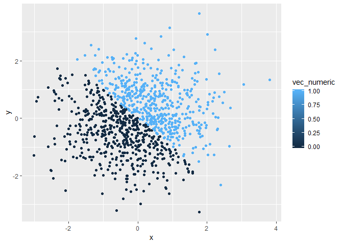

Homework 1
================
Abhishek Ajay (aa4266)
September 14, 2018

Problem 1
=========

Creating a data frame as instructed.

``` r
#Creating data frame problem1_df

set.seed(1)

problem1_df = tibble( 
  vec_numeric = runif(n = 10, min = 0, max = 5),
  vec_logical = vec_numeric > 2,
  vec_char = c("This", "is", "my", "first", "try", "with", "using", "R", "and", "RStudio"),
  vec_factor = factor(c("Male", "Female", "Female", "Female", "Female", "Male", "Female", "Male", "Male", "Female"))
)

problem1_df
```

    ## # A tibble: 10 x 4
    ##    vec_numeric vec_logical vec_char vec_factor
    ##          <dbl> <lgl>       <chr>    <fct>     
    ##  1       1.33  FALSE       This     Male      
    ##  2       1.86  FALSE       is       Female    
    ##  3       2.86  TRUE        my       Female    
    ##  4       4.54  TRUE        first    Female    
    ##  5       1.01  FALSE       try      Female    
    ##  6       4.49  TRUE        with     Male      
    ##  7       4.72  TRUE        using    Female    
    ##  8       3.30  TRUE        R        Male      
    ##  9       3.15  TRUE        and      Male      
    ## 10       0.309 FALSE       RStudio  Female

``` r
#Mean of each variable of our data frame, problem1_df

#We get a mean value since the vector is of numeric data type
mean(problem1_df$vec_numeric) 
```

    ## [1] 2.757569

``` r
#We get a mean value since the logical variables are binomial with True = 1 and False = 0
mean(problem1_df$vec_logical) 
```

    ## [1] 0.6

``` r
#Since the argument isn't numeric or logical, we get NA by coercion
mean(problem1_df$vec_char) 
```

    ## [1] NA

``` r
#Since the argument isn't numeric or logical, we get NA by coercion
mean(problem1_df$vec_factor) 
```

    ## [1] NA

``` r
#Explicit coercion of the logical, character and factor vectors of problem1_df to numeric type

as.numeric(problem1_df$vec_logical)

as.numeric(problem1_df$vec_factor)

as.numeric(problem1_df$vec_char)

#The logical and factor vectors are transformed into numeric data type however, NAs are introduced by coercion into the character vector
```

``` r
#Explicit sequential coercion of the character vectors of problem1_df to factor and then to numeric

#The character column, when tranformed into factor and then numeric gives the index value of each entry as observed in the levels vector
as.numeric(as.factor(problem1_df$vec_char))
```

    ##  [1]  7  3  4  2  8 10  9  5  1  6

``` r
#Explicit sequential coercion of the factor vectors of problem1_df to character and then to numeric


#The factor column when tranformed into character and then numeric has NAs by coercion as its output since it has been converted to character first
as.numeric(as.character(problem1_df$vec_factor))
```

    ##  [1] NA NA NA NA NA NA NA NA NA NA

In the above output we see that the character vector when converted to factor and then that to numeric gives a proper output of integers. However, the factor vector when converted to character and then numeric gives NA for each entry.

Problem 2
=========

``` r
#Creating data frame problem2_df

set.seed(1)

problem2_df = tibble(
  x = rnorm(1000),
  y = rnorm(1000),
  vec_logical = x + y > 0,
  vec_numeric = as.numeric(vec_logical),
  vec_factor = as.factor(vec_logical)
)
```

Short decription of the data frame created for problem 2:

-   The size of our data set is **1000, 5**.

-   The mean of the first column, x, is **-0.0116481**.

-   The median of the first column, x, is **-0.0353242**.

<!-- calculating the proportion of cases where logical vector in problem2_df is true by dividing the length of the list of true responses in the logical vector by the total row count (i.e 1000) -->
-   The proportion of cases for which the logical vector is true: **0.49**.

``` r
#Creating scatter plots of data in problem2_df using the ggplot2 package and saving the first plot

ggplot(problem2_df, aes(x = x, y = y, color = vec_logical)) + geom_point()
```


``` r
ggsave(filename = "C:/Users/abhis/OneDrive/Desktop/School/Semester 1/P8105/homework_1/p8105_hw1_aa4266/problem2_df_colour_logical_plot.png")
```

    ## Saving 7 x 5 in image

``` r
ggplot(problem2_df, aes(x = x, y = y, color = vec_numeric)) + geom_point()
```



``` r
ggplot(problem2_df, aes(x = x, y = y, color = vec_factor)) + geom_point()
```


